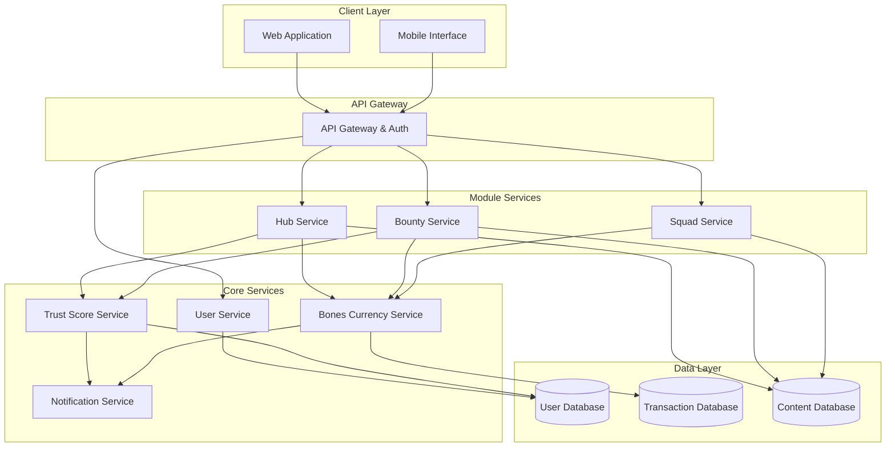

# Design Document: GSD Campus Ecosystem

## Overview

The GSD (Get Stuff Done) campus ecosystem is a comprehensive platform that integrates three core modules—The Hub (marketplace), Bounties (academic services), and Squads (social logistics)—into a unified system governed by a Trust Score reputation mechanism and Bones internal currency. The design emphasizes fairness, transparency, and community trust while preventing economic exploitation.

The system architecture follows a modular approach where each module (Hub, Bounties, Squads) operates independently but shares common services for user management, currency transactions, and reputation tracking. This design ensures scalability, maintainability, and the ability to extend functionality without disrupting existing features.

## Architecture

### High-Level Architecture



### Design Principles

1. **Modularity**: Each module (Hub, Bounties, Squads) is independently deployable
2. **Shared Services**: Common functionality (Trust Score, Bones, Notifications) is centralized
3. **Transaction Integrity**: All currency operations use atomic transactions with escrow
4. **Fair Economy**: Multiple mechanisms prevent pay-to-win and gaming
5. **Transparency**: All reputation and currency changes are logged and auditable

## Components and Interfaces

### 1. User Service

**Responsibilities:**
- User registration and authentication
- Profile management
- Session management
- Account lifecycle

**Key Interfaces:**

```typescript
interface UserService {
  registerUser(email: string, password: string): Promise<User>
  authenticateUser(email: string, password: string): Promise<AuthToken>
  getUserProfile(userId: string): Promise<UserProfile>
  updateUserProfile(userId: string, updates: ProfileUpdates): Promise<UserProfile>
  deleteUser(userId: string): Promise<void>
}

interface User {
  id: string
  email: string
  passwordHash: string
  trustScore: number
  bonesBalance: number
  createdAt: Date
  verifiedStatus: boolean
  failedLoginAttempts: number
  accountLockedUntil: Date | null
}

interface UserProfile {
  id: string
  displayName: string
  bio: string
  profilePhoto: string
  skillTags: string[]
  trustScore: number
  memberSince: Date
  verifiedStatus: boolean
  statistics: UserStatistics
}

interface UserStatistics {
  totalTransactions: number
  completionRate: number
  averageRating: number
  totalEarned: number
  totalSpent: number
}
```

### 2. Trust Score Service

**Responsibilities:**
- Calculate and update Trust Scores
- Apply score adjustments based on user actions
- Enforce score-based restrictions
- Track reputation history

**Key Interfaces:**

```typescript
interface TrustScoreService {
  getTrustScore(userId: string): Promise<number>
  adjustTrustScore(userId: string, adjustment: TrustScoreAdjustment): Promise<number>
  canPerformAction(userId: string, action: ActionType): Promise<boolean>
  getTrustScoreHistory(userId: string): Promise<TrustScoreEvent[]>
}

interface TrustScoreAdjustment {
  userId: string
  amount: number
  reason: TrustScoreReason
  transactionId?: string
  metadata?: Record<string, any>
}

enum TrustScoreReason {
  TRANSACTION_COMPLETED = 'transaction_completed',
  POSITIVE_FEEDBACK = 'positive_feedback',
  NEGATIVE_FEEDBACK = 'negative_feedback',
  TRANSACTION_CANCELLED = 'transaction_cancelled',
  DISPUTE_RESOLVED = 'dispute_resolved',
  POLICY_VIOLATION = 'policy_violation'
}

interface TrustScoreEvent {
  timestamp: Date
  previousScore: number
  newScore: number
  adjustment: number
  reason: TrustScoreReason
  details: string
}

// Trust Score calculation algorithm
function calculateTrustScoreAdjustment(
  event: TransactionEvent,
  userHistory: UserHistory
): number {
  const baseAdjustment = getBaseAdjustment(event.type)
  const transactionValueMultiplier = Math.min(event.value / 100, 2.0)
  const historyMultiplier = calculateHistoryMultiplier(userHistory)
  
  return Math.round(baseAdjustment * transactionValueMultiplier * historyMultiplier)
}
```

### 3. Bones Currency Service

**Responsibilities:**
- Manage Bones balances
- Process transactions with escrow
- Enforce economic rules (daily caps, anti-gaming)
- Maintain transaction ledger

**Key Interfaces:**

```typescript
interface BonesService {
  getBalance(userId: string): Promise<number>
  transferBones(from: string, to: string, amount: number, reason: string): Promise<Transaction>
  escrowBones(userId: string, amount: number, transactionId: string): Promise<Escrow>
  releaseEscrow(escrowId: string, toUserId: string): Promise<Transaction>
  returnEscrow(escrowId: string): Promise<void>
  awardBones(userId: string, amount: number, reason: string): Promise<void>
  canAfford(userId: string, amount: number): Promise<boolean>
  getDailyEarnings(userId: string): Promise<number>
  getTransactionHistory(userId: string): Promise<Transaction[]>
}

interface Transaction {
  id: string
  fromUserId: string
  toUserId: string
  amount: number
  reason: string
  transactionType: TransactionType
  timestamp: Date
  relatedEntityId?: string
}

interface Escrow {
  id: string
  userId: string
  amount: number
  transactionId: string
  createdAt: Date
  status: EscrowStatus
}

enum EscrowStatus {
  ACTIVE = 'active',
  RELEASED = 'released',
  RETURNED = 'returned',
  DISPUTED = 'disputed'
}

enum TransactionType {
  RENTAL_PAYMENT = 'rental_payment',
  BOUNTY_PAYMENT = 'bounty_payment',
  MONEY_POT_CONTRIBUTION = 'money_pot_contribution',
  MONEY_POT_WITHDRAWAL = 'money_pot_withdrawal',
  AWARD = 'award',
  REFUND = 'refund'
}

// Economic balance enforcement
interface EconomicRules {
  DAILY_EARNING_CAP: 200
  MIN_RENTAL_PRICE: 5
  MAX_RENTAL_PRICE: 500
  MIN_BOUNTY_REWARD: 10
  MAX_BOUNTY_REWARD: 1000
  INITIAL_BONES_BALANCE: 100
  TRANSACTION_RATE_LIMIT: 10 // per hour with same user
}
```

### 4. Hub Service

**Responsibilities:**
- Manage item listings
- Process rental requests and confirmations
- Handle rental lifecycle
- Search and discovery

**Key Interfaces:**

```typescript
interface HubService {
  createListing(userId: string, listing: ListingInput): Promise<Listing>
  updateListing(listingId: string, updates: ListingUpdates): Promise<Listing>
  deleteListing(listingId: string): Promise<void>
  getListing(listingId: string): Promise<Listing>
  searchListings(query: SearchQuery): Promise<Listing[]>
  requestRental(userId: string, listingId: string, period: RentalPeriod): Promise<RentalRequest>
  confirmRental(requestId: string): Promise<Rental>
  declineRental(requestId: string): Promise<void>
  completeRental(rentalId: string): Promise<void>
  extendRental(rentalId: string, extension: RentalPeriod): Promise<Rental>
  submitFeedback(rentalId: string, userId: string, feedback: Feedback): Promise<void>
}

interface Listing {
  id: string
  ownerId: string
  itemName: string
  description: string
  category: string
  pricePerDay: number
  photos: string[]
  availability: AvailabilitySchedule
  status: ListingStatus
  createdAt: Date
  lastActiveAt: Date
}

interface RentalRequest {
  id: string
  listingId: string
  renterId: string
  period: RentalPeriod
  totalCost: number
  escrowId: string
  status: RequestStatus
  createdAt: Date
}

interface Rental {
  id: string
  listingId: string
  ownerId: string
  renterId: string
  period: RentalPeriod
  totalCost: number
  escrowId: string
  status: RentalStatus
  startDate: Date
  endDate: Date
  completedAt?: Date
}

interface RentalPeriod {
  startDate: Date
  endDate: Date
  durationDays: number
}

enum ListingStatus {
  ACTIVE = 'active',
  RENTED = 'rented',
  INACTIVE = 'inactive',
  ARCHIVED = 'archived'
}

enum RentalStatus {
  PENDING = 'pending',
  ACTIVE = 'active',
  COMPLETED = 'completed',
  DISPUTED = 'disputed',
  CANCELLED = 'cancelled'
}

interface SearchQuery {
  searchTerm?: string
  category?: string
  minPrice?: number
  maxPrice?: number
  minTrustScore?: number
  availableFrom?: Date
  availableTo?: Date
  sortBy?: 'relevance' | 'price' | 'trustScore'
}
```

### 5. Bounty Service

**Responsibilities:**
- Manage bounty postings
- Handle proposals and assignments
- Process bounty completion
- Match bounties to users

**Key Interfaces:**

```typescript
interface BountyService {
  createBounty(userId: string, bounty: BountyInput): Promise<Bounty>
  getBounty(bountyId: string): Promise<Bounty>
  searchBounties(query: BountySearchQuery): Promise<Bounty[]>
  submitProposal(userId: string, bountyId: string, proposal: ProposalInput): Promise<Proposal>
  acceptProposal(proposalId: string): Promise<Assignment>
  rejectProposal(proposalId: string): Promise<void>
  markComplete(assignmentId: string): Promise<void>
  confirmCompletion(assignmentId: string, feedback: Feedback): Promise<void>
  disputeCompletion(assignmentId: string, reason: string): Promise<Dispute>
  getRecommendedBounties(userId: string): Promise<Bounty[]>
}

interface Bounty {
  id: string
  posterId: string
  title: string
  description: string
  subjectArea: string
  reward: number
  deadline: Date
  escrowId: string
  status: BountyStatus
  createdAt: Date
  proposalCount: number
}

interface Proposal {
  id: string
  bountyId: string
  helperId: string
  message: string
  estimatedCompletion: Date
  status: ProposalStatus
  submittedAt: Date
}

interface Assignment {
  id: string
  bountyId: string
  posterId: string
  helperId: string
  acceptedAt: Date
  completedAt?: Date
  status: AssignmentStatus
}

enum BountyStatus {
  OPEN = 'open',
  ASSIGNED = 'assigned',
  COMPLETED = 'completed',
  EXPIRED = 'expired',
  DISPUTED = 'disputed'
}

enum ProposalStatus {
  PENDING = 'pending',
  ACCEPTED = 'accepted',
  REJECTED = 'rejected'
}

enum AssignmentStatus {
  IN_PROGRESS = 'in_progress',
  PENDING_VERIFICATION = 'pending_verification',
  COMPLETED = 'completed',
  DISPUTED = 'disputed'
}

interface BountySearchQuery {
  searchTerm?: string
  subjectArea?: string
  minReward?: number
  maxReward?: number
  deadlineBefore?: Date
  sortBy?: 'reward' | 'deadline' | 'recent'
}
```

### 6. Squad Service

**Responsibilities:**
- Manage squad creation and membership
- Handle Money Pots
- Coordinate activities
- Process group transactions

**Key Interfaces:**

```typescript
interface SquadService {
  createSquad(userId: string, name: string): Promise<Squad>
  inviteMember(squadId: string, inviterId: string, inviteeEmail: string): Promise<Invitation>
  acceptInvitation(invitationId: string): Promise<void>
  removeMember(squadId: string, adminId: string, memberId: string): Promise<void>
  createMoneyPot(squadId: string, pot: MoneyPotInput): Promise<MoneyPot>
  contributeToMoneyPot(potId: string, userId: string, amount: number): Promise<void>
  withdrawFromMoneyPot(potId: string, adminId: string, amount: number, description: string): Promise<void>
  closeMoneyPot(potId: string): Promise<void>
  postActivity(squadId: string, userId: string, activity: ActivityInput): Promise<Activity>
  rsvpToActivity(activityId: string, userId: string, status: RSVPStatus): Promise<void>
}

interface Squad {
  id: string
  name: string
  adminId: string
  memberIds: string[]
  createdAt: Date
  status: SquadStatus
}

interface MoneyPot {
  id: string
  squadId: string
  name: string
  purpose: string
  targetAmount: number
  currentAmount: number
  contributions: Contribution[]
  transactions: PotTransaction[]
  status: MoneyPotStatus
  createdAt: Date
}

interface Contribution {
  userId: string
  amount: number
  percentage: number
  timestamp: Date
}

interface PotTransaction {
  id: string
  type: 'contribution' | 'withdrawal'
  userId: string
  amount: number
  description: string
  timestamp: Date
}

interface Activity {
  id: string
  squadId: string
  creatorId: string
  title: string
  description: string
  date: Date
  linkedMoneyPotId?: string
  rsvps: RSVP[]
  status: ActivityStatus
}

interface RSVP {
  userId: string
  status: RSVPStatus
  timestamp: Date
}

enum RSVPStatus {
  ATTENDING = 'attending',
  MAYBE = 'maybe',
  NOT_ATTENDING = 'not_attending'
}

enum MoneyPotStatus {
  ACTIVE = 'active',
  TARGET_REACHED = 'target_reached',
  CLOSED = 'closed'
}

enum SquadStatus {
  ACTIVE = 'active',
  ARCHIVED = 'archived'
}
```

### 7. Notification Service

**Responsibilities:**
- Send notifications across channels
- Manage user preferences
- Track notification history
- Handle reminders

**Key Interfaces:**

```typescript
interface NotificationService {
  sendNotification(userId: string, notification: NotificationInput): Promise<void>
  getUserPreferences(userId: string): Promise<NotificationPreferences>
  updatePreferences(userId: string, preferences: NotificationPreferences): Promise<void>
  getNotificationHistory(userId: string, limit: number): Promise<Notification[]>
  scheduleReminder(userId: string, reminder: ReminderInput): Promise<void>
}

interface NotificationInput {
  type: NotificationType
  title: string
  message: string
  actionUrl?: string
  priority: NotificationPriority
  metadata?: Record<string, any>
}

interface Notification {
  id: string
  userId: string
  type: NotificationType
  title: string
  message: string
  actionUrl?: string
  read: boolean
  createdAt: Date
}

enum NotificationType {
  RENTAL_REQUEST = 'rental_request',
  RENTAL_CONFIRMED = 'rental_confirmed',
  RENTAL_ENDING = 'rental_ending',
  BOUNTY_PROPOSAL = 'bounty_proposal',
  BOUNTY_ACCEPTED = 'bounty_accepted',
  BOUNTY_COMPLETED = 'bounty_completed',
  SQUAD_INVITATION = 'squad_invitation',
  MONEY_POT_CONTRIBUTION = 'money_pot_contribution',
  TRUST_SCORE_CHANGE = 'trust_score_change',
  DISPUTE_FILED = 'dispute_filed',
  REMINDER = 'reminder'
}

enum NotificationPriority {
  LOW = 'low',
  MEDIUM = 'medium',
  HIGH = 'high',
  URGENT = 'urgent'
}

interface NotificationPreferences {
  emailEnabled: boolean
  inAppEnabled: boolean
  enabledTypes: NotificationType[]
  quietHoursStart?: string
  quietHoursEnd?: string
}
```

### 8. Dispute Resolution Service

**Responsibilities:**
- Handle dispute filing
- Collect evidence
- Facilitate resolution
- Enforce outcomes

**Key Interfaces:**

```typescript
interface DisputeService {
  fileDispute(dispute: DisputeInput): Promise<Dispute>
  submitEvidence(disputeId: string, userId: string, evidence: Evidence): Promise<void>
  getDispute(disputeId: string): Promise<Dispute>
  resolveDispute(disputeId: string, resolution: DisputeResolution): Promise<void>
  escalateToModerator(disputeId: string): Promise<void>
}

interface Dispute {
  id: string
  transactionId: string
  transactionType: TransactionType
  filerId: string
  respondentId: string
  description: string
  evidence: Evidence[]
  status: DisputeStatus
  resolution?: DisputeResolution
  createdAt: Date
  resolvedAt?: Date
}

interface Evidence {
  userId: string
  description: string
  attachments: string[]
  submittedAt: Date
}

interface DisputeResolution {
  outcome: DisputeOutcome
  bonesDistribution: { userId: string; amount: number }[]
  trustScoreAdjustments: { userId: string; adjustment: number }[]
  notes: string
  resolvedBy: string
}

enum DisputeStatus {
  OPEN = 'open',
  AWAITING_RESPONSE = 'awaiting_response',
  UNDER_REVIEW = 'under_review',
  ESCALATED = 'escalated',
  RESOLVED = 'resolved'
}

enum DisputeOutcome {
  FILER_FAVOR = 'filer_favor',
  RESPONDENT_FAVOR = 'respondent_favor',
  SPLIT_DECISION = 'split_decision',
  NO_FAULT = 'no_fault'
}
```

## Data Models

### Database Schema

**Users Table:**
```sql
CREATE TABLE users (
  id UUID PRIMARY KEY,
  email VARCHAR(255) UNIQUE NOT NULL,
  password_hash VARCHAR(255) NOT NULL,
  trust_score INTEGER DEFAULT 50 CHECK (trust_score >= 0 AND trust_score <= 100),
  bones_balance INTEGER DEFAULT 100 CHECK (bones_balance >= 0),
  verified_status BOOLEAN DEFAULT FALSE,
  failed_login_attempts INTEGER DEFAULT 0,
  account_locked_until TIMESTAMP,
  created_at TIMESTAMP DEFAULT NOW(),
  updated_at TIMESTAMP DEFAULT NOW()
);

CREATE INDEX idx_users_email ON users(email);
CREATE INDEX idx_users_trust_score ON users(trust_score);
```

**User Profiles Table:**
```sql
CREATE TABLE user_profiles (
  user_id UUID PRIMARY KEY REFERENCES users(id) ON DELETE CASCADE,
  display_name VARCHAR(100),
  bio TEXT,
  profile_photo VARCHAR(500),
  skill_tags TEXT[],
  total_transactions INTEGER DEFAULT 0,
  completion_rate DECIMAL(5,2) DEFAULT 0.00,
  average_rating DECIMAL(3,2) DEFAULT 0.00,
  total_earned INTEGER DEFAULT 0,
  total_spent INTEGER DEFAULT 0,
  updated_at TIMESTAMP DEFAULT NOW()
);
```

**Transactions Table:**
```sql
CREATE TABLE transactions (
  id UUID PRIMARY KEY,
  from_user_id UUID REFERENCES users(id),
  to_user_id UUID REFERENCES users(id),
  amount INTEGER NOT NULL CHECK (amount > 0),
  transaction_type VARCHAR(50) NOT NULL,
  reason TEXT,
  related_entity_id UUID,
  created_at TIMESTAMP DEFAULT NOW()
);

CREATE INDEX idx_transactions_from_user ON transactions(from_user_id);
CREATE INDEX idx_transactions_to_user ON transactions(to_user_id);
CREATE INDEX idx_transactions_created_at ON transactions(created_at);
```

**Escrows Table:**
```sql
CREATE TABLE escrows (
  id UUID PRIMARY KEY,
  user_id UUID REFERENCES users(id) NOT NULL,
  amount INTEGER NOT NULL CHECK (amount > 0),
  transaction_id VARCHAR(255) NOT NULL,
  status VARCHAR(20) NOT NULL,
  created_at TIMESTAMP DEFAULT NOW(),
  released_at TIMESTAMP,
  returned_at TIMESTAMP
);

CREATE INDEX idx_escrows_user_id ON escrows(user_id);
CREATE INDEX idx_escrows_status ON escrows(status);
```

**Trust Score Events Table:**
```sql
CREATE TABLE trust_score_events (
  id UUID PRIMARY KEY,
  user_id UUID REFERENCES users(id) NOT NULL,
  previous_score INTEGER NOT NULL,
  new_score INTEGER NOT NULL,
  adjustment INTEGER NOT NULL,
  reason VARCHAR(50) NOT NULL,
  details TEXT,
  transaction_id UUID,
  created_at TIMESTAMP DEFAULT NOW()
);

CREATE INDEX idx_trust_events_user_id ON trust_score_events(user_id);
CREATE INDEX idx_trust_events_created_at ON trust_score_events(created_at);
```

**Listings Table:**
```sql
CREATE TABLE listings (
  id UUID PRIMARY KEY,
  owner_id UUID REFERENCES users(id) NOT NULL,
  item_name VARCHAR(200) NOT NULL,
  description TEXT NOT NULL,
  category VARCHAR(100),
  price_per_day INTEGER NOT NULL CHECK (price_per_day >= 5 AND price_per_day <= 500),
  photos TEXT[],
  availability_schedule JSONB,
  status VARCHAR(20) NOT NULL,
  created_at TIMESTAMP DEFAULT NOW(),
  last_active_at TIMESTAMP DEFAULT NOW()
);

CREATE INDEX idx_listings_owner_id ON listings(owner_id);
CREATE INDEX idx_listings_status ON listings(status);
CREATE INDEX idx_listings_category ON listings(category);
CREATE INDEX idx_listings_price ON listings(price_per_day);
```

**Rentals Table:**
```sql
CREATE TABLE rentals (
  id UUID PRIMARY KEY,
  listing_id UUID REFERENCES listings(id) NOT NULL,
  owner_id UUID REFERENCES users(id) NOT NULL,
  renter_id UUID REFERENCES users(id) NOT NULL,
  start_date TIMESTAMP NOT NULL,
  end_date TIMESTAMP NOT NULL,
  duration_days INTEGER NOT NULL,
  total_cost INTEGER NOT NULL,
  escrow_id UUID REFERENCES escrows(id),
  status VARCHAR(20) NOT NULL,
  completed_at TIMESTAMP,
  created_at TIMESTAMP DEFAULT NOW()
);

CREATE INDEX idx_rentals_listing_id ON rentals(listing_id);
CREATE INDEX idx_rentals_renter_id ON rentals(renter_id);
CREATE INDEX idx_rentals_status ON rentals(status);
```

**Bounties Table:**
```sql
CREATE TABLE bounties (
  id UUID PRIMARY KEY,
  poster_id UUID REFERENCES users(id) NOT NULL,
  title VARCHAR(200) NOT NULL,
  description TEXT NOT NULL,
  subject_area VARCHAR(100) NOT NULL,
  reward INTEGER NOT NULL CHECK (reward >= 10 AND reward <= 1000),
  deadline TIMESTAMP NOT NULL,
  escrow_id UUID REFERENCES escrows(id),
  status VARCHAR(20) NOT NULL,
  proposal_count INTEGER DEFAULT 0,
  created_at TIMESTAMP DEFAULT NOW()
);

CREATE INDEX idx_bounties_poster_id ON bounties(poster_id);
CREATE INDEX idx_bounties_status ON bounties(status);
CREATE INDEX idx_bounties_subject_area ON bounties(subject_area);
CREATE INDEX idx_bounties_deadline ON bounties(deadline);
```

**Proposals Table:**
```sql
CREATE TABLE proposals (
  id UUID PRIMARY KEY,
  bounty_id UUID REFERENCES bounties(id) NOT NULL,
  helper_id UUID REFERENCES users(id) NOT NULL,
  message TEXT NOT NULL,
  estimated_completion TIMESTAMP,
  status VARCHAR(20) NOT NULL,
  submitted_at TIMESTAMP DEFAULT NOW()
);

CREATE INDEX idx_proposals_bounty_id ON proposals(bounty_id);
CREATE INDEX idx_proposals_helper_id ON proposals(helper_id);
```

**Squads Table:**
```sql
CREATE TABLE squads (
  id UUID PRIMARY KEY,
  name VARCHAR(100) NOT NULL,
  admin_id UUID REFERENCES users(id) NOT NULL,
  member_ids UUID[] NOT NULL,
  status VARCHAR(20) NOT NULL,
  created_at TIMESTAMP DEFAULT NOW()
);

CREATE INDEX idx_squads_admin_id ON squads(admin_id);
```

**Money Pots Table:**
```sql
CREATE TABLE money_pots (
  id UUID PRIMARY KEY,
  squad_id UUID REFERENCES squads(id) NOT NULL,
  name VARCHAR(100) NOT NULL,
  purpose TEXT,
  target_amount INTEGER NOT NULL,
  current_amount INTEGER DEFAULT 0,
  contributions JSONB DEFAULT '[]',
  transactions JSONB DEFAULT '[]',
  status VARCHAR(20) NOT NULL,
  created_at TIMESTAMP DEFAULT NOW()
);

CREATE INDEX idx_money_pots_squad_id ON money_pots(squad_id);
```

**Feedback Table:**
```sql
CREATE TABLE feedback (
  id UUID PRIMARY KEY,
  transaction_id UUID NOT NULL,
  transaction_type VARCHAR(50) NOT NULL,
  from_user_id UUID REFERENCES users(id) NOT NULL,
  to_user_id UUID REFERENCES users(id) NOT NULL,
  rating INTEGER NOT NULL CHECK (rating >= 1 AND rating <= 5),
  comment TEXT,
  flagged BOOLEAN DEFAULT FALSE,
  created_at TIMESTAMP DEFAULT NOW()
);

CREATE INDEX idx_feedback_to_user ON feedback(to_user_id);
CREATE INDEX idx_feedback_transaction ON feedback(transaction_id);
```

**Disputes Table:**
```sql
CREATE TABLE disputes (
  id UUID PRIMARY KEY,
  transaction_id UUID NOT NULL,
  transaction_type VARCHAR(50) NOT NULL,
  filer_id UUID REFERENCES users(id) NOT NULL,
  respondent_id UUID REFERENCES users(id) NOT NULL,
  description TEXT NOT NULL,
  evidence JSONB DEFAULT '[]',
  status VARCHAR(20) NOT NULL,
  resolution JSONB,
  created_at TIMESTAMP DEFAULT NOW(),
  resolved_at TIMESTAMP
);

CREATE INDEX idx_disputes_status ON disputes(status);
CREATE INDEX idx_disputes_filer_id ON disputes(filer_id);
```


## Correctness Properties

*A property is a characteristic or behavior that should hold true across all valid executions of a system—essentially, a formal statement about what the system should do. Properties serve as the bridge between human-readable specifications and machine-verifiable correctness guarantees.*

### Property Reflection

After analyzing all acceptance criteria, I've identified several areas where properties can be consolidated to avoid redundancy:

- **Trust Score updates**: Multiple criteria (2.1, 2.2, 8.8, 18.3) all relate to Trust Score changes. These can be consolidated into comprehensive properties about Trust Score calculation and updates.
- **Escrow operations**: Criteria 3.7, 5.1, 5.3, 5.4, 7.4 all involve escrow. These can be combined into properties about escrow lifecycle.
- **Transaction atomicity**: Criteria 3.2, 11.2 both test atomic balance updates. These can be unified.
- **Validation boundaries**: Multiple criteria test min/max values (4.4, 7.3, 10.7). These can be consolidated into validation properties.
- **Notification delivery**: Criteria 13.1, 13.4 overlap in testing notification delivery. These can be combined.
- **Display requirements**: Many criteria (2.4, 4.7, 6.4, 7.6, etc.) test that rendered output includes specific information. These can be grouped by entity type.

### Core Properties

#### User Authentication and Registration

**Property 1: Valid registration creates account with initial state**
*For any* valid campus email and password, registering a new user should create an account with Trust_Score of 50, Bones balance of 100, and verified_status of false.
**Validates: Requirements 1.1, 1.5**

**Property 2: Invalid credentials are rejected**
*For any* invalid email format or non-campus domain, registration attempts should be rejected with an appropriate error message.
**Validates: Requirements 1.2**

**Property 3: Registration and authentication round-trip**
*For any* valid credentials, if a user successfully registers, then immediately authenticating with those same credentials should succeed.
**Validates: Requirements 1.3**

#### Trust Score System

**Property 4: Trust Score bounds are maintained**
*For any* Trust Score adjustment, the resulting Trust Score should remain within the range [0, 100].
**Validates: Requirements 2.1, 2.2, 2.3, 2.7**

**Property 5: Successful transactions increase Trust Score**
*For any* completed transaction (rental or bounty), both parties' Trust Scores should increase by 1 to 5 points based on transaction value.
**Validates: Requirements 2.1, 8.8**

**Property 6: Negative feedback decreases Trust Score**
*For any* negative feedback submission, the recipient's Trust Score should decrease by 3 to 10 points based on severity.
**Validates: Requirements 2.2**

**Property 7: Trust Score calculation is deterministic**
*For any* user with identical transaction history, feedback ratings, account age, and community engagement, the calculated Trust Score should be the same.
**Validates: Requirements 2.7**

**Property 8: User profiles display Trust Score**
*For any* user profile rendering, the output should contain the user's current Trust Score.
**Validates: Requirements 2.4**

#### Bones Currency System

**Property 9: Bones transfers are atomic**
*For any* Bones transfer between two users, either both balances update correctly (sender decreases, receiver increases by the same amount) or neither balance changes.
**Validates: Requirements 3.2, 11.2**

**Property 10: Bones balance never goes negative**
*For any* sequence of Bones operations on a user account, the balance should never become negative.
**Validates: Requirements 3.5**

**Property 11: Insufficient balance prevents transactions**
*For any* transaction attempt where the user's Bones balance is less than the required amount, the transaction should be prevented and the user notified.
**Validates: Requirements 3.5, 5.6, 7.5**

**Property 12: Daily earning cap is enforced**
*For any* user on any given day, the total Bones earned through platform activities should not exceed 200 Bones.
**Validates: Requirements 3.6, 16.1**

**Property 13: All Bones movements are logged**
*For any* Bones transaction (transfer, award, escrow, refund), an entry should exist in the transaction ledger with complete details.
**Validates: Requirements 3.8**

**Property 14: Escrow lifecycle is correct**
*For any* escrow operation, Bones should be: (1) deducted from user balance when escrowed, (2) held in escrow state, and (3) either released to recipient or returned to original user, never both.
**Validates: Requirements 3.7, 5.1, 5.3, 5.4, 7.4**

**Property 15: No direct Bones transfers outside transactions**
*For any* attempt to transfer Bones directly between users without a legitimate transaction context (rental, bounty, Money_Pot), the transfer should be prevented.
**Validates: Requirements 16.6**

#### The Hub - Listings

**Property 16: Valid listings are created successfully**
*For any* listing with all required fields (name, description, price, availability, photo) and valid values, the listing should be created and published to The Hub.
**Validates: Requirements 4.1, 4.2**

**Property 17: Incomplete listings are rejected**
*For any* listing missing required fields, the creation should be prevented and the missing fields indicated to the user.
**Validates: Requirements 4.3**

**Property 18: Listing price validation**
*For any* listing, the price per day should be between 5 and 500 Bones (inclusive).
**Validates: Requirements 4.4**

**Property 19: Listing updates preserve consistency**
*For any* active listing without pending rental requests, updates should be applied immediately; for listings with pending requests, updates should be deferred.
**Validates: Requirements 4.5**

**Property 20: Listing deletion removes from Hub**
*For any* listing with no active rentals, deletion should remove the listing from search results and detail views.
**Validates: Requirements 4.6**

**Property 21: Listings display owner Trust Score**
*For any* listing rendering, the output should include the owner's current Trust Score.
**Validates: Requirements 4.7**

#### The Hub - Rentals

**Property 22: Rental request creates escrow**
*For any* rental request, the total rental cost should be placed in escrow and deducted from the renter's balance.
**Validates: Requirements 5.1**

**Property 23: Rental confirmation finalizes transaction**
*For any* confirmed rental request, the rental should become active and both parties should receive contact information.
**Validates: Requirements 5.2**

**Property 24: Rental decline returns escrow**
*For any* declined rental request, the escrowed Bones should be returned to the renter's balance immediately.
**Validates: Requirements 5.3**

**Property 25: Rental completion transfers payment**
*For any* rental that reaches its end date, the escrowed Bones should be transferred to the item owner and both parties prompted for feedback.
**Validates: Requirements 5.4**

**Property 26: Rental dispute freezes escrow**
*For any* rental where a dispute is reported, the escrowed Bones should be frozen and not available to either party until resolution.
**Validates: Requirements 5.5**

**Property 27: Rental extension requires availability and funds**
*For any* rental extension request, it should succeed only if the item remains available for the extension period and the renter has sufficient Bones.
**Validates: Requirements 5.8**

#### The Hub - Search

**Property 28: Search returns matching listings**
*For any* search query, all returned listings should contain the query terms in either the item name or description.
**Validates: Requirements 6.1**

**Property 29: Filters correctly restrict results**
*For any* combination of filters (category, price range, availability, Trust Score), all returned listings should satisfy all applied filters.
**Validates: Requirements 6.2**

**Property 30: Search results are sorted correctly**
*For any* search results, listings should be sorted by relevance with higher Trust Score owners prioritized when relevance is equal.
**Validates: Requirements 6.3**

**Property 31: Listings display availability status**
*For any* listing rendering in search results, the output should clearly indicate whether the item is available, rented, or inactive.
**Validates: Requirements 6.4**

#### Bounties - Creation and Management

**Property 32: Valid bounties are created with escrow**
*For any* bounty with all required fields (title, description, subject area, reward, deadline) and sufficient Bones, the bounty should be created and the reward placed in escrow.
**Validates: Requirements 7.1, 7.2, 7.4**

**Property 33: Bounty reward validation**
*For any* bounty, the reward should be between 10 and 1000 Bones (inclusive).
**Validates: Requirements 7.3**

**Property 34: Insufficient funds prevents bounty creation**
*For any* bounty creation attempt where the user's Bones balance is less than the reward amount, the creation should be prevented.
**Validates: Requirements 7.5**

**Property 35: Bounties display poster Trust Score**
*For any* bounty rendering, the output should include the poster's current Trust Score.
**Validates: Requirements 7.6**

#### Bounties - Fulfillment

**Property 36: Proposal submission notifies poster**
*For any* proposal submitted to a bounty, the bounty poster should receive a notification and the proposal should be displayed.
**Validates: Requirements 8.1**

**Property 37: Proposal acceptance assigns bounty**
*For any* accepted proposal, the bounty should be assigned to the helper and both parties should receive contact information.
**Validates: Requirements 8.2**

**Property 38: Proposal rejection allows other proposals**
*For any* rejected proposal, the helper should be notified and the bounty should remain open for other proposals.
**Validates: Requirements 8.3**

**Property 39: Bounty completion requires verification**
*For any* bounty marked complete by the helper, the poster should be notified for verification before payment is released.
**Validates: Requirements 8.4**

**Property 40: Confirmed completion transfers payment and updates Trust Scores**
*For any* bounty completion confirmed by the poster, the escrowed Bones should be transferred to the helper and both users' Trust Scores should increase.
**Validates: Requirements 8.5, 8.8**

**Property 41: Bounty dispute freezes payment**
*For any* bounty where completion is disputed, the escrowed Bones should be frozen and dispute resolution initiated.
**Validates: Requirements 8.6**

**Property 42: Bounty completion allows rating**
*For any* completed bounty, the poster should be able to rate the helper.
**Validates: Requirements 8.7**

#### Bounties - Search and Matching

**Property 43: Bounty search sorts correctly**
*For any* bounty search results, bounties should be sorted by reward amount and deadline proximity.
**Validates: Requirements 9.1**

**Property 44: Bounty filters work correctly**
*For any* combination of bounty filters (subject area, reward range, deadline), all returned bounties should satisfy all applied filters.
**Validates: Requirements 9.2**

**Property 45: Skill-based recommendations are relevant**
*For any* user with specified skill areas, recommended bounties should match at least one of the user's skills.
**Validates: Requirements 9.3**

**Property 46: Bounties display proposal count**
*For any* bounty rendering, the output should include the current number of proposals submitted.
**Validates: Requirements 9.4**

**Property 47: Bounties display poster information**
*For any* bounty rendering, the output should include the poster's Trust Score and historical completion rate.
**Validates: Requirements 9.5**

#### Squads - Management

**Property 48: Squad creation assigns admin**
*For any* valid squad name, creating a squad should establish the squad with the creator as admin and initial member.
**Validates: Requirements 10.1**

**Property 49: Squad invitations notify invitees**
*For any* squad invitation sent, the invitee should receive a notification with options to accept or decline.
**Validates: Requirements 10.2, 10.3**

**Property 50: Invitation acceptance adds member**
*For any* accepted squad invitation, the user should be added to the squad's member list.
**Validates: Requirements 10.4**

**Property 51: Member removal settles Money_Pot obligations**
*For any* squad member removal, if the member has outstanding Money_Pot contributions, those should be settled before removal.
**Validates: Requirements 10.5, 10.6**

**Property 52: Squad size validation**
*For any* squad, the number of members should be between 2 and 50 (inclusive).
**Validates: Requirements 10.7**

#### Squads - Money Pots

**Property 53: Money_Pot creation initializes correctly**
*For any* Money_Pot with valid target amount and purpose, creation should initialize the pot with zero current amount and empty contribution list.
**Validates: Requirements 11.1**

**Property 54: Money_Pot contributions update balances atomically**
*For any* Money_Pot contribution, the contributor's Bones balance should decrease and the Money_Pot current amount should increase by the same amount atomically.
**Validates: Requirements 11.2**

**Property 55: Money_Pot displays contribution details**
*For any* Money_Pot rendering, the output should show each member's contribution amount and percentage of total.
**Validates: Requirements 11.3**

**Property 56: Money_Pot target reached triggers notification**
*For any* Money_Pot where a contribution causes the current amount to reach or exceed the target amount, all squad members should be notified.
**Validates: Requirements 11.4**

**Property 57: Money_Pot withdrawals are logged and notified**
*For any* Money_Pot withdrawal by an admin, the transaction should be recorded with description and all members notified.
**Validates: Requirements 11.5, 11.6**

**Property 58: Money_Pot maintains complete transaction history**
*For any* Money_Pot, all contributions and withdrawals should be recorded in the transaction history.
**Validates: Requirements 11.7**

**Property 59: Money_Pot closure distributes proportionally**
*For any* Money_Pot closure with remaining Bones, the remaining amount should be distributed to contributors in proportion to their contribution percentages.
**Validates: Requirements 11.8**

#### Squads - Activities

**Property 60: Activity posting notifies squad**
*For any* activity posted to a squad, all squad members should receive a notification.
**Validates: Requirements 12.1**

**Property 61: RSVP updates activity status**
*For any* RSVP to an activity, the user's RSVP status should be recorded and visible to all squad members.
**Validates: Requirements 12.2**

**Property 62: Activities can link to Money_Pots**
*For any* activity with an associated cost, the activity should be linkable to a Money_Pot for expense management.
**Validates: Requirements 12.3**

**Property 63: Activities are sorted chronologically**
*For any* squad's activity list, upcoming activities should be displayed in chronological order by date.
**Validates: Requirements 12.4**

#### Notifications

**Property 64: Critical events trigger immediate notifications**
*For any* rental request, bounty proposal, or squad invitation, the relevant user should receive an immediate notification.
**Validates: Requirements 13.1**

**Property 65: Notification preferences are respected**
*For any* notification, it should only be sent through channels (in-app, email) that the user has enabled in their preferences.
**Validates: Requirements 13.2, 13.4**

**Property 66: Trust Score changes notify users**
*For any* significant Trust Score change (>= 5 points), the user should receive a notification with an explanation of the change.
**Validates: Requirements 13.5**

**Property 67: Notification history is retrievable**
*For any* user, they should be able to retrieve notifications from the past 30 days.
**Validates: Requirements 13.6**

#### Dispute Resolution

**Property 68: Dispute filing freezes escrow**
*For any* dispute filed on a transaction, the related escrowed Bones should be frozen and both parties notified.
**Validates: Requirements 14.1**

**Property 69: Disputes require evidence**
*For any* dispute filing attempt without evidence and description, the filing should be prevented.
**Validates: Requirements 14.2**

**Property 70: Dispute resolution distributes Bones and adjusts Trust Scores**
*For any* resolved dispute, the escrowed Bones should be distributed according to the resolution and both parties' Trust Scores adjusted accordingly.
**Validates: Requirements 14.5**

**Property 71: All disputes are logged**
*For any* dispute filed, a complete record should be maintained including evidence, statements, and resolution.
**Validates: Requirements 14.6**

#### User Profiles

**Property 72: User profiles display required information**
*For any* user profile rendering, the output should include Trust Score, member since date, and verification status (Bones balance only for own profile).
**Validates: Requirements 15.1**

**Property 73: Own profile shows complete transaction history**
*For any* user viewing their own profile, the complete transaction history including rentals, bounties, and Money_Pot contributions should be displayed.
**Validates: Requirements 15.2**

**Property 74: Profiles display feedback and ratings**
*For any* user profile, the feedback and ratings received from other users should be viewable.
**Validates: Requirements 15.3**

**Property 75: Profile statistics are calculated correctly**
*For any* user profile, the displayed statistics (total transactions, completion rate, average rating) should accurately reflect the user's transaction history.
**Validates: Requirements 15.4**

**Property 76: Other users' profiles hide private information**
*For any* user viewing another user's profile, private information (Bones balance, private details) should not be displayed.
**Validates: Requirements 15.5**

**Property 77: Profile updates are persisted**
*For any* profile update (photo, bio, skill tags), the changes should be saved and reflected in subsequent profile views.
**Validates: Requirements 15.6**

#### Economic Balance and Anti-Gaming

**Property 78: Rate limiting prevents rapid transactions**
*For any* user attempting more than 10 transactions per hour with the same user, rate limiting should be applied.
**Validates: Requirements 16.4**

**Property 79: Email uniqueness prevents multiple accounts**
*For any* registration attempt with an email already in use, the registration should be prevented.
**Validates: Requirements 16.3**

**Property 80: Gaming behavior triggers penalties**
*For any* user whose behavior is flagged as gaming or exploitation, their Trust Score should be reduced and account privileges restricted.
**Validates: Requirements 16.7**

**Property 81: Suspicious patterns flag accounts**
*For any* user exhibiting suspicious transaction patterns (e.g., circular transactions, abnormal frequency), the account should be flagged for review.
**Validates: Requirements 16.2**

#### Data Privacy and Security

**Property 82: Passwords are hashed**
*For any* user account, the password should be stored as a hash, never in plaintext.
**Validates: Requirements 17.1**

**Property 83: Contact information privacy is maintained**
*For any* transaction, user contact information should only be shared after both parties confirm the transaction.
**Validates: Requirements 17.3**

**Property 84: Account deletion removes personal data**
*For any* account deletion, personal information should be removed while transaction records are anonymized and preserved.
**Validates: Requirements 17.4**

**Property 85: Data export is available**
*For any* user requesting data export, the system should provide all their personal data in a portable format.
**Validates: Requirements 17.5**

**Property 86: Security events are logged**
*For any* security-relevant event (login, failed login, password change, etc.), an entry should be created in the security audit log.
**Validates: Requirements 17.7**

#### Feedback and Ratings

**Property 87: Transaction completion prompts feedback**
*For any* completed transaction (rental or bounty), both parties should be prompted to provide ratings and optional feedback.
**Validates: Requirements 18.1**

**Property 88: Ratings use 5-star scale**
*For any* feedback submission, the rating should be between 1 and 5 stars (inclusive).
**Validates: Requirements 18.2**

**Property 89: Feedback updates Trust Score**
*For any* feedback submission, the recipient's Trust Score should be updated based on the rating.
**Validates: Requirements 18.3**

**Property 90: Average ratings are calculated correctly**
*For any* user profile, the displayed average rating should be the mean of all ratings received.
**Validates: Requirements 18.4**

**Property 91: Inappropriate feedback can be reported**
*For any* feedback, users should be able to report it as inappropriate or abusive.
**Validates: Requirements 18.5**

**Property 92: Verified inappropriate feedback is removed**
*For any* feedback verified as inappropriate, it should be removed and the submitter's Trust Score penalized.
**Validates: Requirements 18.6**

**Property 93: Feedback is immutable after submission**
*For any* submitted feedback, attempts to edit it should be prevented.
**Validates: Requirements 18.7**

#### Platform Moderation

**Property 94: Moderator reviews include context**
*For any* flagged content reviewed by a moderator, the system should provide user history and related transactions as context.
**Validates: Requirements 19.1**

**Property 95: Moderators can remove content**
*For any* listing, bounty, or content that violates guidelines, moderators should be able to remove it.
**Validates: Requirements 19.2**

**Property 96: Moderation actions are logged and notified**
*For any* moderation action, the action should be logged and affected users notified with an explanation.
**Validates: Requirements 19.3**

**Property 97: Moderators can adjust Trust Scores**
*For any* verified policy violation, moderators should be able to manually adjust the violator's Trust Score.
**Validates: Requirements 19.4**

**Property 98: Moderators can suspend accounts**
*For any* severe violation, moderators should be able to suspend or ban user accounts.
**Validates: Requirements 19.5**

**Property 99: Moderation analytics are available**
*For any* moderator, analytics on platform health (dispute rates, Trust Score distribution) should be accessible.
**Validates: Requirements 19.6**

#### Mobile Responsiveness

**Property 100: Interfaces render responsively**
*For any* screen width between 320px and 768px, all interfaces should render correctly without horizontal scrolling or broken layouts.
**Validates: Requirements 20.1**

**Property 101: Mobile maintains full functionality**
*For any* transaction type (rental, bounty, Money_Pot), the functionality should work correctly on mobile devices.
**Validates: Requirements 20.3**

**Property 102: Session state persists across devices**
*For any* user switching between devices, the session state and data should be synchronized.
**Validates: Requirements 20.5**

## Error Handling

### Error Categories

1. **Validation Errors**: Invalid input data (missing fields, out-of-range values)
2. **Authorization Errors**: Insufficient permissions or Trust Score restrictions
3. **Resource Errors**: Insufficient Bones, unavailable items, expired deadlines
4. **Conflict Errors**: Concurrent modifications, duplicate actions
5. **System Errors**: Database failures, external service unavailability

### Error Handling Strategy

**Validation Errors:**
- Validate all inputs at the API boundary
- Return descriptive error messages indicating which fields are invalid
- Use HTTP 400 Bad Request status code
- Never expose internal system details in error messages

**Authorization Errors:**
- Check user permissions before processing requests
- Verify Trust Score requirements for restricted actions
- Return HTTP 403 Forbidden for permission issues
- Log authorization failures for security monitoring

**Resource Errors:**
- Check resource availability before starting transactions
- Use optimistic locking for concurrent access
- Return HTTP 409 Conflict for resource conflicts
- Provide clear messages about why resources are unavailable

**Transaction Failures:**
- Wrap all Bones operations in database transactions
- Implement automatic rollback on any failure
- Log all transaction failures for debugging
- Retry transient failures with exponential backoff

**Escrow Error Handling:**
- If escrow creation fails, prevent transaction from proceeding
- If escrow release fails, mark for manual review
- Never leave Bones in limbo—always in user balance or escrow
- Implement reconciliation jobs to detect and fix escrow inconsistencies

**Dispute Handling:**
- Freeze all related resources when dispute is filed
- Prevent any state changes to disputed transactions
- Maintain complete audit trail of dispute process
- Implement timeout mechanisms for unresponsive parties

**System Errors:**
- Log all system errors with full context
- Return HTTP 500 Internal Server Error
- Provide generic error message to users
- Implement circuit breakers for external dependencies
- Use dead letter queues for failed async operations

### Error Recovery

**Idempotency:**
- All API operations should be idempotent where possible
- Use idempotency keys for critical operations
- Store operation results to prevent duplicate processing

**Compensation:**
- Implement compensation logic for failed multi-step operations
- Automatically refund Bones if transaction fails after escrow
- Send notifications for any automatic compensations

**Manual Intervention:**
- Flag complex failures for moderator review
- Provide admin tools for manual resolution
- Maintain audit trail of all manual interventions

## Testing Strategy

### Dual Testing Approach

The GSD platform requires both unit testing and property-based testing to ensure comprehensive coverage:

**Unit Tests:**
- Specific examples demonstrating correct behavior
- Edge cases and boundary conditions
- Integration points between modules
- Error conditions and failure scenarios
- Time-based logic with mocked time

**Property-Based Tests:**
- Universal properties that hold for all inputs
- Comprehensive input coverage through randomization
- Invariant verification across operations
- Round-trip properties for serialization/parsing
- Minimum 100 iterations per property test

### Property-Based Testing Configuration

**Library Selection:**
- TypeScript/JavaScript: fast-check
- Python: Hypothesis
- Java: jqwik
- Go: gopter

**Test Configuration:**
- Minimum 100 iterations per property test
- Each test tagged with: **Feature: gsd-campus-ecosystem, Property {number}: {property_text}**
- Seed-based reproducibility for failed tests
- Shrinking enabled to find minimal failing cases

**Generator Strategy:**
- Create custom generators for domain objects (User, Listing, Bounty, Squad)
- Ensure generated data respects business constraints
- Generate edge cases (empty strings, boundary values, null/undefined)
- Use stateful testing for complex workflows

### Test Organization

**Unit Test Structure:**
```
tests/
  unit/
    user/
      registration.test.ts
      authentication.test.ts
      profile.test.ts
    trust-score/
      calculation.test.ts
      adjustments.test.ts
    bones/
      transfers.test.ts
      escrow.test.ts
    hub/
      listings.test.ts
      rentals.test.ts
      search.test.ts
    bounties/
      creation.test.ts
      fulfillment.test.ts
      search.test.ts
    squads/
      management.test.ts
      money-pots.test.ts
      activities.test.ts
```

**Property Test Structure:**
```
tests/
  properties/
    user-properties.test.ts
    trust-score-properties.test.ts
    bones-properties.test.ts
    hub-properties.test.ts
    bounty-properties.test.ts
    squad-properties.test.ts
    integration-properties.test.ts
```

### Critical Test Scenarios

**Trust Score Integrity:**
- Verify Trust Score never exceeds [0, 100] bounds
- Test that all score adjustments are logged
- Verify score-based restrictions are enforced

**Bones Economy:**
- Test atomic transfers under concurrent access
- Verify escrow lifecycle correctness
- Test daily earning cap enforcement
- Verify no Bones can be created or destroyed (conservation)

**Transaction Workflows:**
- Test complete rental lifecycle (request → confirm → complete)
- Test complete bounty lifecycle (post → propose → accept → complete)
- Test Money_Pot lifecycle (create → contribute → withdraw → close)
- Test dispute resolution workflows

**Security:**
- Test authentication and authorization
- Verify password hashing
- Test rate limiting
- Verify privacy controls

**Data Integrity:**
- Test referential integrity across tables
- Verify cascade deletes work correctly
- Test transaction rollback on failures

### Integration Testing

**API Integration Tests:**
- Test complete user journeys through API
- Verify correct HTTP status codes
- Test authentication and authorization
- Verify error responses

**Database Integration Tests:**
- Test database constraints
- Verify indexes improve query performance
- Test transaction isolation levels
- Verify backup and restore procedures

**External Service Integration:**
- Test email notification delivery
- Test file upload and storage
- Test any third-party API integrations
- Use mocks for external dependencies in unit tests

### Performance Testing

**Load Testing:**
- Simulate concurrent users (100, 1000, 10000)
- Test database query performance under load
- Verify API response times meet SLAs
- Test escrow operations under high concurrency

**Stress Testing:**
- Test system behavior at capacity limits
- Verify graceful degradation
- Test recovery after failures

### Test Data Management

**Test Data Generation:**
- Use factories for creating test objects
- Implement builders for complex objects
- Use property-based testing generators for randomized data

**Test Database:**
- Use separate test database
- Reset database state between tests
- Use transactions for test isolation
- Seed database with realistic test data

### Continuous Integration

**CI Pipeline:**
1. Run linting and code formatting checks
2. Run unit tests (fast feedback)
3. Run property-based tests (comprehensive coverage)
4. Run integration tests
5. Generate code coverage report (target: >80%)
6. Run security scans
7. Build and deploy to staging environment

**Test Execution:**
- Run unit tests on every commit
- Run full test suite on pull requests
- Run property tests with extended iterations nightly
- Run performance tests weekly
